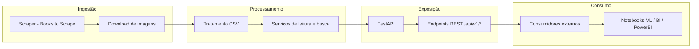

# fiap-tech-cha-fase1

## Descrição do Projeto

Entrega do **Tech Challenge - Fase 1 (Machine Learning Engineering)**: construir um pipeline (ingestão → processamento → API) para disponibilizar dados de livros extraídos via web scraping e prontos para consumo por times de ML e sistemas de recomendação.

Resumo rápido:

- Fonte de dados: <https://books.toscrape.com/>
- Formato de saída principal: CSV (local)
- API: RESTful (FastAPI) com documentação OpenAPI/Swagger

---

## Arquitetura e Pipeline

O projeto é dividido em três camadas principais:

1. **Ingestão (Scripts de Scraping)**
   - O módulo `scripts/scraper.py` coleta informações de todos os livros do site Books to Scrape.
   - Os dados brutos são salvos em `data/livros.csv`, e as imagens correspondentes em `data/imagens/`.
   - Cada livro é identificado pelo seu `UPC` (unique product code).

2. **Processamento (Camada de Serviços)**
   - O módulo `app/services/livros_service.py` realiza a leitura e o tratamento dos dados do CSV.
   - Fornece funções de listagem, busca e categorização.
   - Pode ser estendido para limpeza e normalização de dados antes de uso em ML.

3. **Exposição (Camada de API)**
   - A aplicação FastAPI (`app/main.py`) expõe endpoints REST.
   - Inclui documentação automática (`/docs` e `/redoc`).
   - Estrutura modular (routers versionados em `/api/v1/`).

Fluxo do pipeline:



---

### Escalabilidade futura

A arquitetura foi pensada para crescer sem mudanças estruturais.
A API é stateless, podendo ser replicada em múltiplas instâncias.
O scraping pode evoluir para execução agendada ou distribuída.
O armazenamento hoje é em CSV, mas pode migrar facilmente para banco relacional ou armazenamento em nuvem (como Postgres ou S3).
A containerização com Docker permite implantações em provedores de serviços com serviços de container. Garantindo portabilidade e escalabilidade horizontal quando o volume de dados aumentar.

## Aplicação no Machine Learning

Os dados coletados formam um dataset com campos úteis para experimentos de Machine Learning:

| Campo | Descrição | Tipo | Uso em ML |
|-------|------------|------|-----------|
| title | Título do livro | texto | tokenização, embeddings |
| price | Preço | numérico | variável de regressão ou feature em recomendação |
| rating | Avaliação (1–5) | categórico | classificação, modelagem de preferências |
| category | Gênero | categórico | agrupamento, segmentação |
| availability | Disponibilidade | categórico | análise de estoque ou previsão de vendas |

Cenários de uso:

- **Sistemas de recomendação:** recomendar livros com base em categoria e rating.
- **Modelos de precificação:** prever preço médio por categoria.
- **Análise de sentimento (extensão futura):** associar resenhas (se adicionadas).

O dataset `livros.csv` pode ser usado diretamente em notebooks de ML (pandas, scikit-learn, etc.).

---

## Instruções de instalação e configuração

### Requisitos

- Python 3.11 ou superior  
- Poetry (ou pip)

### .env

Crie um arquivo `.env` na raiz do projeto:

```env
APP_NAME=fiap_tech_cha_fase1
HOST=127.0.0.1
PORT=8000
RELOAD=False
LOG_LEVEL=info
APP_IMPORT_PATH=fiap_tech_cha_fase1.app.main:app
```

### Clonando o repositório

```bash
git clone https://github.com/wildersa/fiap_tech_cha_fase1.git
cd fiap_tech_cha_fase1
```

### Instalando dependências

Via Poetry:

```bash
poetry install
```

Ou via pip:

```bash
pip install -r requirements.txt
```

### Ativar ambiente

```bash
.\.venv\Scripts\activate
```

### Executar Scraper

Para gerar o dataset atualizado:

```bash
python -m fiap_tech_cha_fase1.scripts.scraper
```

Use o parâmetro --debug para exibir logs detalhados de execução:

```bash
python -m fiap_tech_cha_fase1.scripts.scraper --debug
```

O scraper:

- Usa o `UPC` do próprio site como ID único.  
- Gera `data/livros.csv` e imagens em `data/imagens/`.  
- Evita baixar imagens duplicadas.

---

### Executando a aplicação

Via Poetry:

```bash
poetry run python -m fiap_tech_cha_fase1
```

Via python diretamente:

```bash
python -m fiap_tech_cha_fase1
```

A aplicação estará disponível em:  
`http://127.0.0.1:8000`

---

## Rotas da API

- Documentação automática: `http://127.0.0.1:8000/docs`
- Redoc: `http://127.0.0.1:8000/redoc`

### Rotas obrigatórias

- GET `/api/v1/books` — lista todos os livros  
- GET `/api/v1/books/{id}` — detalhes de um livro pelo ID  
- GET `/api/v1/books/search?title={title}&category={category}` — busca por título e/ou categoria  
- GET `/api/v1/categories` — lista todas as categorias  
- GET `/api/v1/health` — status da API  

### Rotas adicionais (opcional / insights)

- GET `/api/v1/stats/overview` — estatísticas gerais (total de livros, preço médio, distribuição de ratings)  
- GET `/api/v1/stats/categories` — agregações por categoria  

---

## Exemplos de chamadas

### GET `/api/v1/books`

```bash
curl http://127.0.0.1:8000/api/v1/books
```

```json
[
  {
    "id": "23356462d1320d61",
    "title": "In Her Wake",
    "price": "£12.84",
    "rating": "One",
    "availability": "In stock",
    "category": "Thriller",
    "local_image": "data/imagens/23356462d1320d61.jpg"
  }
]
```

### GET `/api/v1/books/{id}`

```bash
curl http://127.0.0.1:8000/api/v1/books/23356462d1320d61
```

```json
{
  "id": "23356462d1320d61",
  "title": "In Her Wake",
  "price": "£12.84",
  "rating": "One",
  "availability": "In stock",
  "local_image": "data/imagens/23356462d1320d61.jpg"
}
```

### GET `/api/v1/books/search?title=In Her Wake&category=Thriller`

```bash
curl "http://127.0.0.1:8000/api/v1/books/search?title=In Her Wake&category=Thriller"
```

```json
[
  {
    "id": "23356462d1320d61",
    "title": "In Her Wake",
    "price": "£12.84",
    "rating": "One",
    "availability": "In stock",
    "local_image": "data/imagens/23356462d1320d61.jpg"
  }
]
```

### GET `/api/v1/categories`

```bash
curl http://127.0.0.1:8000/api/v1/categories
```

```json
[
  { "id": "1", "name": "Category 1" },
  { "id": "2", "name": "Category 2" }
]
```

### GET `/api/v1/health`

```bash
curl http://127.0.0.1:8000/api/v1/health
```

```json
{ "status": "ok" }
```

---

## Deploy e Entrega

- Deploy público: [https://fiap-tech-cha-fase1.vercel.app/](https://fiap-tech-cha-fase1.vercel.app/)  
- Documentação da API: [https://fiap-tech-cha-fase1.vercel.app/docs](https://fiap-tech-cha-fase1.vercel.app/docs)  
- Vídeo de demonstração: *(inserir link do vídeo aqui)*

---

## Autor

Wilder Schmidt Andreatta  
FIAP | Pós Tech - Machine Learning Engineering  
Fase 1 — Web Scraping e API de Livros
